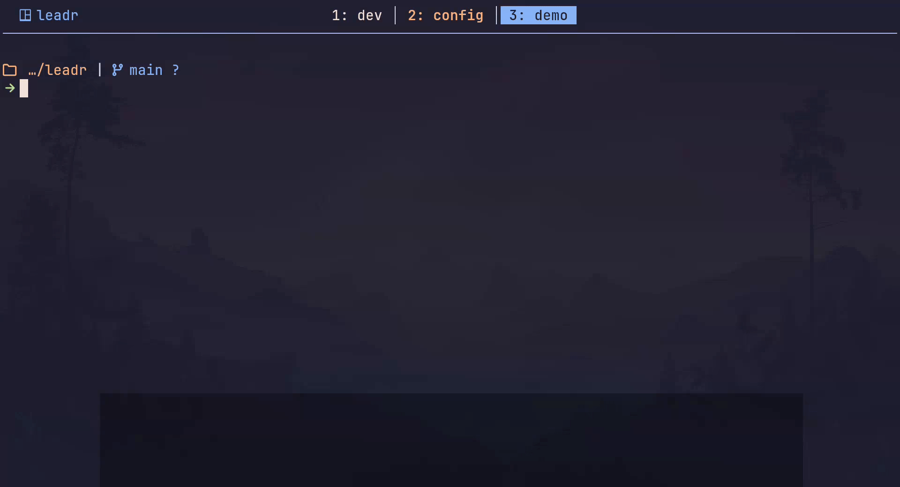

# leadr

**leadr** is a customizable CLI command manager inspired by the leader key concept in (Neo)Vim.
Use memorable key sequences to quickly execute or insert commands in your terminal.

## 🚀 Demo



## 💪 Features

- **Customizable Mappings**: Define your own key sequences to set your prompt.
- **Insert or Execute**: Immediately execute `git status` or just insert `git commit -m ""` ready for you to fill in.
- **Prepend/Append**: Forgot `sudo`? Just prepend it to the your prompt and keep typing.
- **Surround**: Wrap your current command in quotes or use `$(command substitution)` in the blink of an eye.
- **Cursor Positioning**: Automatically place your cursor at the right position after inserting or replacing commands.
- **Evaluate pre-insert**: Need the current date in your file name? Evaluate a command, then insert it.
- **Keybinding Panel**: In case they slipped your mind, see available mappings in a fancy looking pop-up.

## 🎮 Usage

After installing `leadr`, you can start using it by pressing the `leadr` keybinding followed by a key sequence.

With the default config, you can e.g. execute `git status` by pressing `<Ctrl-g>` followed by `gs`.
Similarly, you can pre-populate `git commit -m ""` by pressing `<Ctrl-g>` followed by `gc`.
Notice how your cursor is placed in between the double quotes? Neat, right?

But that's not all!
`<Ctrl-g>ps` will prepend `sudo` to your currently typed command, `<Ctrl-g>y` will append a pipe to the system clipboard.

Want me to continue?
Alright: `<Ctrl-g>id` will insert the current date wherever your cursor is, `<Ctrl-g>sq` will surround your current command in quotes.

You can get the tl;dr of all this by running
```bash
leadr --list
```
which will show you a list of all available mappings and their descriptions.

Consult the [Configuration](#-configuration) section to learn how to make `leadr` your own.

## ⚡️ Requirements

- bash or zsh
- [crossterm](https://docs.rs/crossterm/latest/crossterm/index.html) compatible terminal (see [their Readme for a list](https://github.com/crossterm-rs/crossterm?tab=readme-ov-file#tested-terminals))

## 📦 Installation

> **Note**: This project is still in early development, expect some breaking changes every now and then.

<details>
<summary>From pre-built binaries</summary>

You can download pre-built binaries from the [releases page](https://github.com/ll-nick/leadr/releases/latest).
Just copy the binary to a directory in your `PATH` and make it executable.

</details>

<details>
<summary>From crates.io</summary>

You can install `leadr` using cargo:
```bash
cargo install leadr
```
This will install the latest version of `leadr` from [crates.io](https://crates.io/crates/leadr).

</details>

<details>
<summary>From source</summary>

You can build `leadr` from source using cargo:

```bash
git clone https://github.com/ll-nick/leadr.git
cd leadr
cargo install --path .
```

</details>

## 🐚 Shell Integration

To use `leadr`, simply add the following line to your shell configuration file (e.g. `~/.bashrc` or `~/.zshrc`):

```bash
# For bash
source <(leadr --bash)
```

```zsh
# For zsh
source <(leadr --zsh)
```

## 🛠️ Configuration

### Configuration File

`leadr` will automatically create a configuration file and fill it with some default mappings the first time you run it.
See [confy's Readme](https://github.com/rust-cli/confy?tab=readme-ov-file#config-file-location) for the location of the configuration file.

Modify the configuration file to add your own mappings or adjust the `leadr` keybinding.

### Mappings

Define new mappings by adding a new entry to the `mappings` section of the configuration file.
The key will be the key sequence you want to use, `command` will be the command you want to execute or insert.
Optionally, add a `description` for the `--list` command to show.

Finally, you can customize the behavior of the mapping by specifying `insert_type`, `evaluate`, and `execute` options.
Here's an overview of the available options:

| Setting | Options | Description |
| ------- | ------- | ----------- |
| `insert_type` | 'Replace' (default) | Clears the current prompt and replaces it with the command. Cursor will be placed at the end of the prompt. |
|               | 'Insert' | Inserts the command at the current cursor position. Cursor will be placed at the end of the inserted command. |
|               | 'Prepend' | Prepends the command to the current prompt. Cursor will be placed where it was before adding the prefix. |
|               | 'Append' | Appends the command to the current prompt. Cursor will be placed at the end of the prompt. |
|               | 'Surround' | Surrounds the current prompt, i.e. adds a prefix and a suffix. The defined command has to contain `#COMMAND` which will be replaced by the current prompt. The cursor will be placed at the end of the prompt. |
| `evaluate` | `true` or `false` (default) | If `true`, the command will be evaluated before being inserted. |
| `execute` | `true` or `false` (default) | If `true`, the command will be executed immediately. |

The cursor position after inserting or replacing commands can be customized by adding `#CURSOR` to the command.
For the `git commit -m ""` example, define the command as `git commit -m "#CURSOR"` to place the cursor between the double quotes after inserting the command.
This works for all insert types but will have no effect if `evaluate` or `execute` is set to `true`.

> **Note**: `execute` works best inside a `tmux` session since it can utilize `tmux`'s `send-keys` to execute commands.
> Outside of `tmux`, `leadr` will fallback to `eval` and manually append the command to the shell's history.


### Leadr Keybinding

For a list of currently supported keybindings, see [src/keymap.rs](src/keymap.rs).

### User Interface

Leadr comes with a user interface that looks suspiciously similar to [which-key](https://github.com/folke/which-key.nvim).
It is activated by default an will pop up after a short delay after pressing the `leadr` keybinding.
